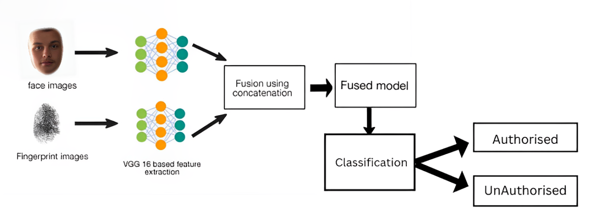
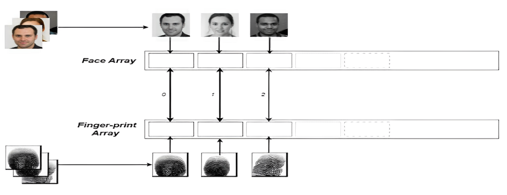
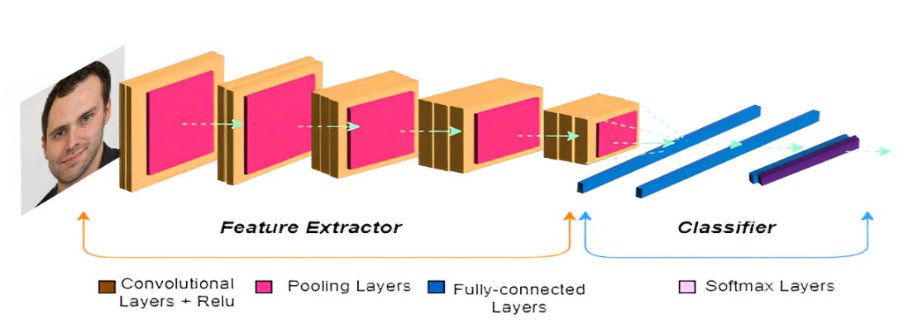
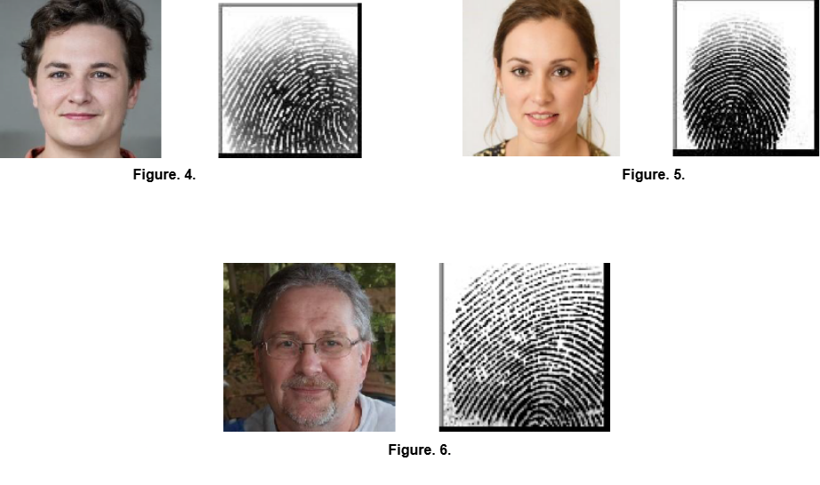

# **Multimodal-Fusion-for-Person-Identification**
## **Overview**
This project explores biometric person identification using **multimodal fusion techniques**, combining **facial features** and **fingerprints** to enhance identification accuracy. Leveraging **deep learning** with the **VGG16 architecture**, the system achieves robust and reliable results for security-sensitive applications.

---

## **Motivation**
This is my **first project in machine learning**. During this project:
- I conducted a **literature survey** to understand models and approaches for biometric systems.
- I implemented the **VGG16 architecture** for feature extraction due to its simplicity and high performance.
- This experience allowed me to learn:
  - Fundamentals of machine learning.
  - Data processing and feature extraction techniques.
  - Model evaluation metrics and processes.

---

## **Methodology**

### 1️⃣ **Datasets**
- **SOCOFing Dataset**: Includes **6,000 fingerprint images** for training and evaluation.
- **Synthetic Face Dataset**: Contains **10,000 high-resolution synthetic face images** for robust testing.

**Proposed Methodology**:

The methodology starts by collecting and organizing face and fingerprint images from two datasets. These images are preprocessed (resized, converted to RGB for fingerprints) using libraries like PIL, NumPy, and TensorFlow. A pre-trained CNN model, such as VGG16, is used for feature extraction, capturing high-level features from both modalities. The extracted features are concatenated to create a combined feature set. Dimensionality reduction techniques (e.g., PCA) are applied, followed by classification using models like SVM or deep learning-based classifiers. This multimodal fusion approach improves accuracy by combining complementary information from both face and fingerprint images for person identification.

**Data Mapping**:

### 2️⃣ **Model: VGG16 Architecture**

- **VGG16 Overview**:
  - A deep convolutional neural network with **16 layers**.
  - Extracts fine details using small receptive fields (**3x3 filters**).
  - Includes **ReLU activation** for efficient training and **max pooling** for downsampling.

- **Why VGG16?**
  - Its depth and simplicity make it ideal for feature extraction from both facial and fingerprint data.

**VGG16 Architecture**:

### 3️⃣ **Feature Fusion**
- Features from face and fingerprint images are extracted using VGG16 and combined into a single feature vector.
- The combined vector is used for classification (authorized vs. non-authorized).

### 4️⃣ **Tools and Technologies**
- **Languages**: Python
- **Libraries**: TensorFlow, Keras, NumPy, Matplotlib

---

## **Results**

### Key Achievements:
- Achieved **99.99% accuracy** for identifying individuals using fused face and fingerprint features.
- Successfully classified:
  - **Authorized Users**: Correctly matched face and fingerprint data.
  - **Non-Authorized Users**: Accurately flagged individuals without valid biometrics.

### Sample Results:
- **Authorized User Prediction**: Correctly identified individuals.
- **Non-Authorized User Prediction**: Successfully flagged invalid cases.
## **4.1 Authorized User**
Utilizing the trained version, the second combined photo from the dataset was used for prediction. The model appropriately predicted the label, facilitating the retrieval and display of related face and fingerprint images. The diagnosed face and fingerprint snapshots associated with the predicted label are illustrated in Figures 1 and 2, respectively.

### **4.2 Random Authorized User**
The model's performance was further evaluated using numerous testing techniques to examine its effectiveness and generalization capability. A set of 100 random test images was selected from the mixed test dataset. The model's accuracy on these random check images was calculated, yielding an accuracy of 100%. This assessment tested the model's ability to generalize and make accurate predictions on diverse and randomly chosen test samples.

### **4.3 Random Non-Authorized User Image**
Additionally, non-authorized user images were recognized within the combined dataset. A random non-authorized user image was selected for evaluation of the model on non-authorized users. This section did not explicitly perform the evaluation for non-authorized users, but this can be further investigated to assess the model's performance in accurately identifying non-authorized individuals.

(The assessment of the model on non-authorized users was now not explicitly performed inside
this section but can be further investigated for assessing the version's overall performance as it
should be figuring out non-authorized individuals.)

**Fig. 4**. Identified Face and Fingerprint Image.

**Fig. 5**. Random input Identified Face and Fingerprint Image.

**Fig. 6**. Random Non-Authorized User Image.

---

## **Different Modalities and Their Accuracies**

| Identification Modality       | Reference                                                                  | Performance      |
|-------------------------------|----------------------------------------------------------------------------|------------------|
| Face                          | [Simonyan & Zisserman, 2014](https://arxiv.org/abs/1409.1556)              | 99.97%           | 
| Fingerprint                   | [Ali et al., 2016](https://doi.org/10.1109/IACC.2016.332)                  | 99.87%           | 
| Iris                          | [Patil et al., 2014](https://www.ijcaonline.org/)                          | 95.93%           | 
| Palmprint                     | [Han et al., 2021](https://www.mdpi.com/2227-7390/9/22/2976)               | 99.63%           | 
| **Our Model (Face+Fingerprint)** | *This Work*                                                                | **99.99%**       |

---

## **Learnings**
- **Data Preprocessing**: Managed multimodal data for machine learning tasks.
- **Feature Extraction**: Utilized deep learning to extract high-level features.
- **Model Evaluation**: Evaluated system performance using confusion matrices and other metrics.
- **Feature Fusion**: Learned to combine biometric modalities for enhanced system accuracy.

---

## **References**
1. **SOCOFing Dataset**: Dataset for fingerprint images. [Access Dataset](https://www.kaggle.com/datasets/ruizgara/socofing)
2. **Simonyan & Zisserman, 2014**: "Very deep convolutional networks for large-scale image recognition." [View Paper](https://arxiv.org/abs/1409.1556)
3. **Ali et al., 2016**: "Fingerprint recognition for person identification and verification based on minutiae matching." [View Paper](https://doi.org/10.1109/IACC.2016.332)
4. **Patil et al., 2014**: "Multimodal biometric identification system: Fusion of Iris and fingerprint." [View Paper](https://www.ijcaonline.org/)
5. **Han et al., 2021**: "Multimodal Identification Based on Fingerprint and Face Images via a Hetero-Associative Memory Method." [View Paper](https://www.mdpi.com/2227-7390/9/22/2976)

---

## **Contact**
- **G.Gyaneshwar Rao**
- Email: [ggyaneshwarrao1@gmail.com](mailto:ggyaneshwarrao1@gmail.com)
  
**Other Teammates:**
  
- Yaseer Mulla: [yaseermulla604@gmail.com]
- Sanjana Madiwalar: [sanjanashiv04@gmail.com]
